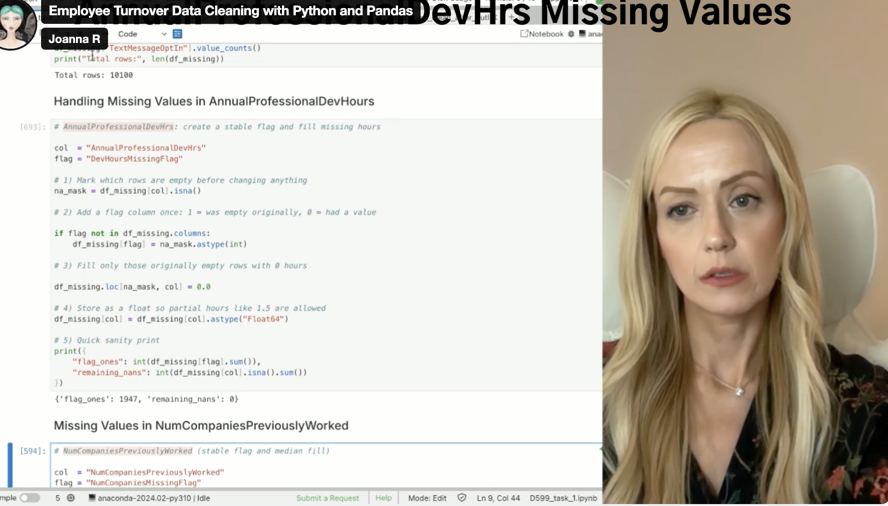

# Employee Turnover Data Cleaning  
*A structured Python workflow for preparing raw HR data for attrition and workforce analytics.*

---

## Overview
This project focuses on transforming a raw Human Resources dataset into a **clean, structured, and analysis-ready** format to support employee turnover analysis.  

**Business question:**  
> “Which teams are losing people — and why?”

The workflow includes:
- Systematic **data profiling**
- Targeted **data cleaning**
- **Validation checks** and business rule enforcement
- **Flagging for transparency**, ensuring reproducibility and data integrity

---

## Video Walkthrough
A complete video presentation demonstrates the entire data cleaning workflow — from inspection to validation.

**[Watch the full project walkthrough on Vimeo](https://vimeo.com/1128386953/734a795bc5)**

<p align="center">
  <a href="https://vimeo.com/1128386953/734a795bc5">
    
  </a>
</p>

---

## What’s Covered in the Video
- **Data Profiling:** Reviewing dataset shape, variable types, and observable values  
- **Data Cleaning:**
  - Handling duplicates
  - Imputing missing values with flags
  - Formatting and standardizing categorical fields
  - Validating derived salary calculations
  - Detecting and flagging outliers
- **Final Checks:** Ensuring no missing values remain, duplicates are removed, and variables follow business rules.  
- **Tools:** Python 3.10.14, Pandas 2.1.4, NumPy 1.26.4  
- **Outcome:** A fully cleaned dataset ready for exploratory analysis or modeling.

---

## Technical Environment
- **Programming Language:** Python 3.10.14  
- **Libraries:** Pandas 2.1.4, NumPy 1.26.4  
- **Operating System:** Linux  

All cleaning steps were implemented in a reproducible **Jupyter Notebook** and exported as both `.py` and `.pdf` for version control and portability.

---

## Dataset Overview
- **Source file:** `employee_turnover_dataset.csv`  
- **Rows:** 10,199  
- **Columns:** 16  
- **Primary Key:** `EmployeeNumber` (unique identifier)

| Variable                          | Data Type     | Subtype                      | Notes                                   |
|------------------------------------|---------------|-------------------------------|------------------------------------------|
| EmployeeNumber                     | Categorical   | Identifier                   | Primary Key                             |
| Age                                | Numeric       | Continuous                   | Years                                   |
| Tenure                             | Numeric       | Discrete                     | Years of service                        |
| Turnover                           | Categorical   | Binary (Yes/No)              | Target variable                         |
| HourlyRate                         | Numeric       | Continuous (currency)        | Converted from string                   |
| HoursWeekly                        | Numeric       | Discrete                     | Hours worked                            |
| CompensationType                   | Categorical   | Nominal                      | Hourly vs Salary                        |
| AnnualSalary                       | Numeric       | Continuous (derived)         | Validated with business rules          |
| DrivingCommuterDistance            | Numeric       | Continuous                   | Outliers handled and flagged           |
| JobRoleArea                        | Categorical   | Nominal                      | Department/role                         |
| Gender                             | Categorical   | Nominal                      | M/F/Prefer Not to Answer               |
| MaritalStatus                      | Categorical   | Nominal                      | Single/Married/Divorced                |
| NumCompaniesPreviouslyWorked       | Numeric       | Discrete (nullable)          | Imputed median, flagged                |
| AnnualProfessionalDevHrs          | Numeric       | Continuous (nullable)        | Imputed zero/median, flagged           |
| PaycheckMethod                     | Categorical   | Nominal                      | Standardized labels                    |
| TextMessageOptIn                   | Categorical   | Binary (Yes/No/Unknown)      | Flagged missing values                 |

---

## Data Profiling Steps
1. **Shape Check:** `df.shape` → 10,199 rows × 16 columns  
2. **Variable Inventory:** `df.info()` + data dictionary mapping  
3. **Sample Inspection:** `df.head()` and `df.sample(5)` to spot early issues  
4. **Category Audits:** Unique value checks to detect inconsistent labeling and formatting

---

## Data Cleaning Process

### 1. Duplicates
- **Finding:** 99 exact duplicates detected (`df.duplicated().sum()`).  
- **Action:** Removed duplicates, retaining the first occurrence.  
- **Result:** 10,100 records remain. Primary key uniqueness confirmed.

### 2. Missing Values
- `TextMessageOptIn` — normalized Yes/No, flagged missing values.  
- `AnnualProfessionalDevHrs` — imputed 0.0 with missingness flag; median optional.  
- `NumCompaniesPreviouslyWorked` — imputed median (4), flagged missing.

### 3. Formatting and Consistency
- Removed underscores and trimmed whitespace.  
- Standardized categorical labels (e.g., `Mail_Check` → `Mailed Check`).  
- Converted `HourlyRate` from string with `$` to numeric.  
- Stripped whitespace from column names.

### 4. Derived Field Validation
- Recomputed `AnnualSalary` as HourlyRate × HoursWeekly × 52
- Flagged and corrected 2,122 mismatched values with $1 tolerance.

### 5. Outliers
- Negative commuter distances replaced with NaN and imputed with the median (49 miles).  
- Distances above the 99th percentile flagged (not removed).  
- Preserved outlier signals for future modeling.

---

## Final Quality Checks

| Metric                        | Before      | After        |
|-------------------------------|-------------|--------------|
| Rows                          | 10,199      | 10,100       |
| Duplicates                    | 99          | 0            |
| Total Missing Values          | 4,868       | 0 (flagged)  |
| Annual Salary Mismatches      | 2,122       | 0            |
| Inconsistent Paycheck Labels  | 7 variants  | 2 standardized |

---

## File Structure
```
employee-turnover-data-cleaning/
├── README.md
├── scripts/
│   └── employee_turnover.py
├── notebooks/
│   └── employee_turnover.ipynb
├── data/
│   ├── employee_turnover_dataset.csv
│   └── employee_turnover_after_outlier_fix.csv
├── assets/
│   └── thumbnail.png
├── docs/ # Documentation (final report)
│   └── employee_turnover.pdf
```
---

## Key Takeaways
- A **structured cleaning workflow** transforms raw HR data into analysis-ready information.  
- Transparent **flagging** allows future analysts to trace every modification.  
- Clean data ensures that turnover analysis — a critical HR metric — is **accurate, reproducible, and decision-useful**.

---

## References
- MacDonald, J. (2025). *Data Deduplication Best Practices.*  
- Koneshloo, A. (2025). *Practical Outlier Handling for Business Data.*  
- Cabral, M. (2025). *Missing Data Strategies in Workforce Analytics.*  
- Internal data dictionary and supporting documentation.
