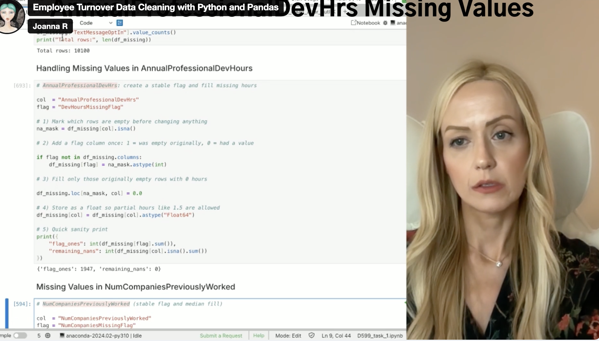

# Employee Turnover Data Cleaning

*A structured Python workflow for preparing raw HR data for employee turnover and workforce analytics.*

---

# Project Overview

This project focuses on transforming a raw Human Resources dataset into a **clean, structured, and analysis-ready** format to support employee turnover analysis.

**Business Question**

> **Which teams are losing people—and why?**

The workflow demonstrates a systematic approach to:

- Data profiling
- Data cleaning
- Validation and business rule enforcement
- Transparent flagging for reproducibility and data integrity

The resulting dataset is suitable for exploratory analysis, workforce reporting, predictive modeling, and employee attrition analytics.

---

# Skills Demonstrated

- Data Cleaning
- Data Profiling
- Data Validation
- Feature Engineering
- Missing Data Imputation
- Outlier Detection
- Data Quality Assurance
- Business Rule Validation
- Python
- Pandas
- NumPy

---

# Technologies

- Python 3.10.14
- Pandas 2.1.4
- NumPy 1.26.4
- Jupyter Notebook

---

# 🎥 Project Presentation

A complete presentation of the project is available on Vimeo. The presentation explains the business problem, data preparation methodology, validation process, quality assurance techniques, and the importance of clean data for employee turnover analytics.

▶️ **Watch the Project Presentation**

https://vimeo.com/1205140794

---

# 🎥 Technical Implementation Walkthrough

A detailed implementation walkthrough demonstrates the complete data cleaning workflow—from initial profiling through validation and final quality checks.

<p align="center">
  <a href="https://vimeo.com/1128386953/734a795bc5">
    
  </a>
</p>

**Watch the Technical Walkthrough**

https://vimeo.com/1128386953/734a795bc5

---

# Dataset Overview

- **Source file:** `employee_turnover_dataset.csv`
- **Rows:** 10,199
- **Columns:** 16
- **Primary Key:** `EmployeeNumber`

| Variable | Data Type | Subtype | Notes |
|-----------|-----------|----------|------|
| EmployeeNumber | Categorical | Identifier | Primary Key |
| Age | Numeric | Continuous | Years |
| Tenure | Numeric | Discrete | Years of service |
| Turnover | Categorical | Binary | Target variable |
| HourlyRate | Numeric | Continuous | Converted from string |
| HoursWeekly | Numeric | Discrete | Hours worked |
| CompensationType | Categorical | Nominal | Hourly vs Salary |
| AnnualSalary | Numeric | Continuous | Derived and validated |
| DrivingCommuterDistance | Numeric | Continuous | Outliers handled and flagged |
| JobRoleArea | Categorical | Nominal | Department/role |
| Gender | Categorical | Nominal | M/F/Prefer Not to Answer |
| MaritalStatus | Categorical | Nominal | Single/Married/Divorced |
| NumCompaniesPreviouslyWorked | Numeric | Discrete | Median imputed |
| AnnualProfessionalDevHrs | Numeric | Continuous | Missing values imputed |
| PaycheckMethod | Categorical | Nominal | Standardized labels |
| TextMessageOptIn | Categorical | Binary | Missing values flagged |

---

# Data Profiling

The workflow began with a comprehensive assessment of dataset quality.

Steps included:

1. Dataset shape verification
2. Variable inventory
3. Sample inspection
4. Category audits
5. Missing value analysis
6. Duplicate detection

---

# Data Cleaning Process

## Duplicate Records

- Detected 99 duplicate records.
- Removed duplicates while preserving the first occurrence.
- Confirmed primary key uniqueness.

## Missing Values

- Imputed missing values using business rules.
- Added transparency flags for imputed records.
- Eliminated missing values while preserving auditability.

## Formatting and Consistency

- Standardized categorical labels.
- Removed unnecessary whitespace.
- Converted currency fields to numeric values.
- Normalized inconsistent values.

## Derived Field Validation

- Recalculated Annual Salary.
- Corrected 2,122 inconsistent salary values using business rules.

## Outlier Handling

- Corrected invalid commuter distances.
- Flagged extreme values instead of removing them.
- Preserved potentially valuable analytical information.

---

# Final Quality Checks

| Metric | Before | After |
|---------|-------:|------:|
| Rows | 10,199 | 10,100 |
| Duplicate Records | 99 | 0 |
| Missing Values | 4,868 | 0 (flagged) |
| Salary Mismatches | 2,122 | 0 |
| Paycheck Labels | 7 | 2 standardized |

---

# Repository Structure

```text
employee-turnover-data-cleaning/
├── README.md
├── scripts/
│   └── employee_turnover.py
├── notebooks/
│   └── employee_turnover.ipynb
├── data/
│   ├── employee_turnover_dataset.csv
│   └── employee_turnover_after_outlier_fix.csv
├── assets/
│   └── thumbnail.png
├── docs/
│   └── employee_turnover.pdf
└── awards/
    └── WGU_Excellence_Award_Data_Preparation_and_Exploration.pdf
```

---

# Key Takeaways

This project demonstrates that a structured data cleaning workflow can:

- Transform raw HR data into analysis-ready information.
- Improve data quality through validation and business rule enforcement.
- Preserve transparency using data quality flags.
- Produce reliable datasets suitable for workforce analytics and predictive modeling.

---

# Business Value

Clean, trustworthy data enables organizations to:

- Improve employee turnover analysis
- Support predictive workforce analytics
- Increase confidence in business reporting
- Reduce downstream data quality issues
- Build reliable machine learning models

---

# 🏆 Recognition

This project received a **WGU Excellence Award** for exemplary work in **Data Preparation and Exploration (Task 1).**

The award certificate is included in the `awards/` directory.

---

# Author

**Joanna Ronchi**

- Master of Science in Data Science
- Bachelor of Science in Information Technology Management

GitHub: https://github.com/joannar77
